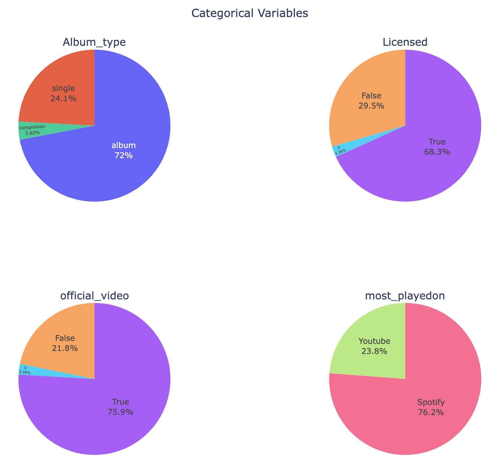
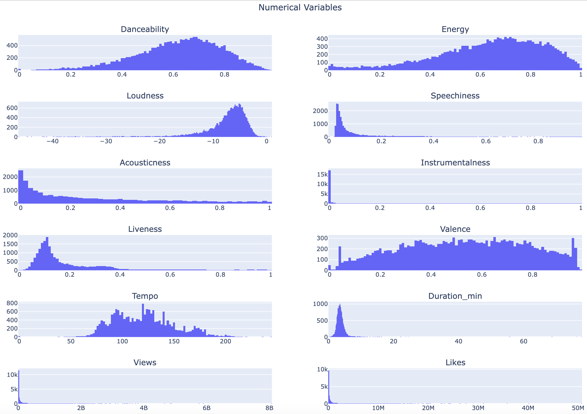
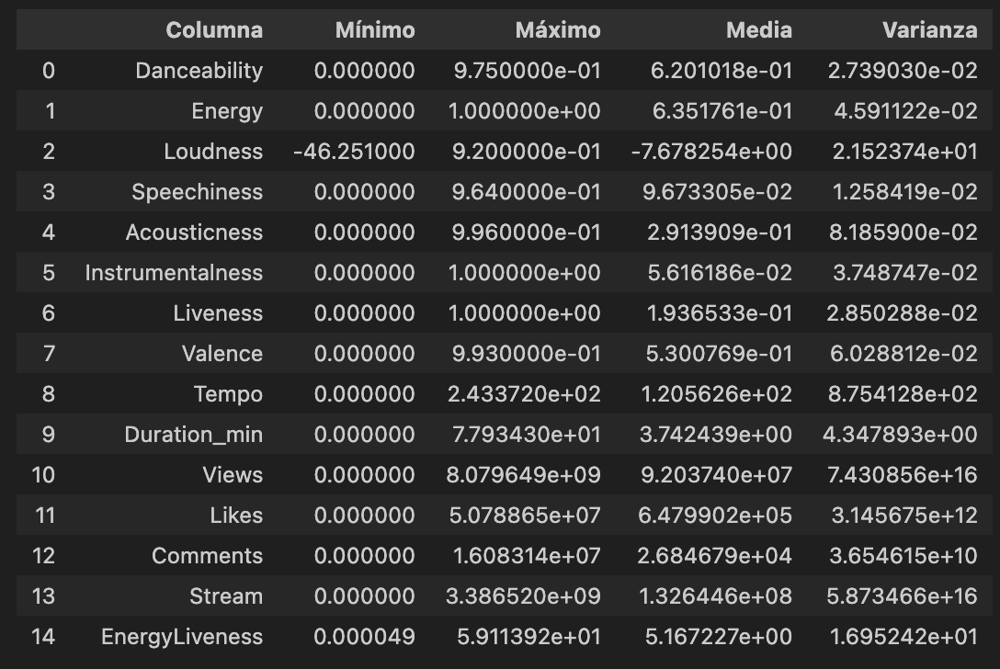
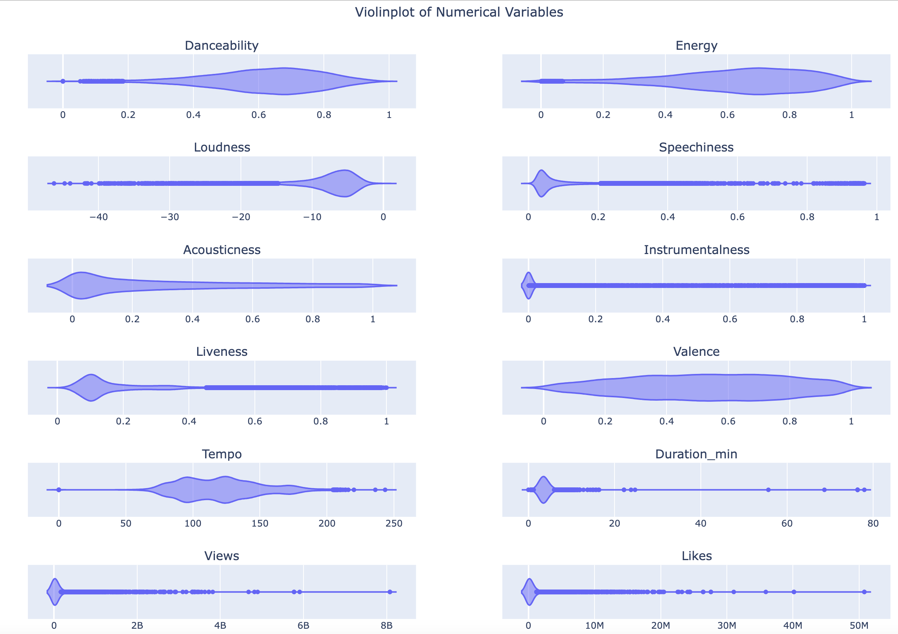
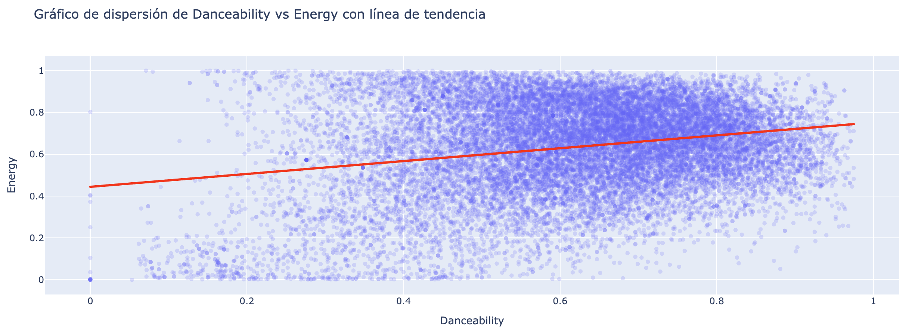
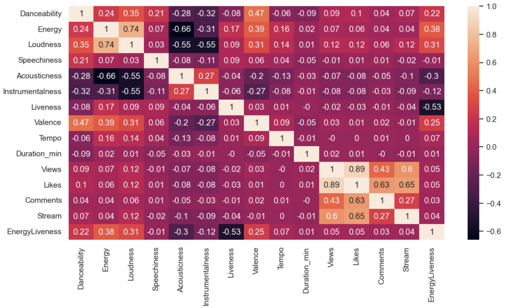

# Proyecto (Final): "Music makes the people come together"

## Motivación

El proyecto surge como idea familiar para salir del bucle de canciones que escuchamos en viajes largos.

El set de datos se ha obtenido de [Kaggle](https://www.kaggle.com/datasets/sanjanchaudhari/spotify-dataset). Debido al tamaño (5MB) no está incluido en el proyecto (GitHub tan sólo permite 2MB como tamaño de fichero máximo en las cuentas gratuitas).

## EDA (Exploratory Data Analysis)

En general se trata de un dataset bastante limpio, aunque no por ello exento de algunas anomalías:

- Las columnas `'Licensed'` y `'official_video'`, siendo de tipo __string__, presentaban valores de distinta índole en el sentido de que había mezclados 'True', 'False' y '0'. 

- La columna `'Title'` no siempre presenta valor; algunas veces es '0'.

- Algunos nulos en la columna `'EnergyLiveness'`.

### Columnas Categóricas

Los valores anómalos en `'Licensed'` y `'official_video'` quedan descubiertos al visualizar dichas columnas mediante gráficos de pastel.

<!---->

### Columnas Numéricas

Las columnas numéricas son muy diversas, tanto en valores absolutos, como en distribución y varianza.

  

  

Asimismo, presentan numerosos valores atípicos.

  

Es impracticable trazar un _paiplot_ de todas las variables numéricas; la gráfica queda minúscula y poco útil. Como ejemplo, mostraremos el gráfico de dispersión entre dos variables cualesquiera.

  

Del aspecto de nube deducimos que esas dos variables no están correlacionadas. De hecho, lo comprobamos mediante la matriz de correlación.

  

