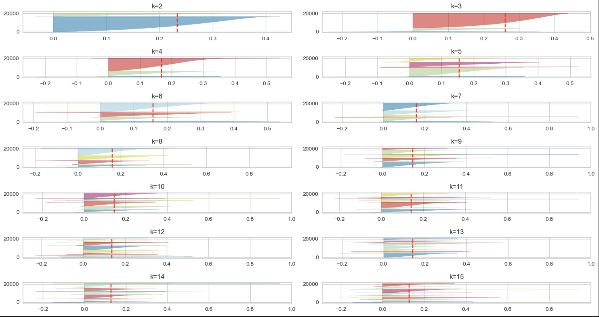
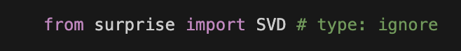

# Proyecto (Final): "Music makes the people come together"

## Motivación

El proyecto surge como idea familiar para salir del bucle de canciones que escuchamos en viajes largos.

El set de datos se ha obtenido de [Kaggle](https://www.kaggle.com/datasets/sanjanchaudhari/spotify-dataset). Debido al tamaño (5MB) no está incluido en el proyecto (GitHub tan sólo permite 2MB como tamaño de fichero máximo en las cuentas gratuitas).

## EDA (Exploratory Data Analysis)

En general se trata de un dataset bastante limpio, aunque no por ello exento de algunas anomalías:

- Las columnas `'Licensed'` y `'official_video'`, siendo de tipo __string__, presentaban valores de distinta índole en el sentido de que había mezclados 'True', 'False' y '0'. 

- La columna `'Title'` no siempre presenta valor; algunas veces es '0'.

- Algunos nulos en la columna `'EnergyLiveness'`.

### Columnas Categóricas

Los valores anómalos en `'Licensed'` y `'official_video'` quedan descubiertos al visualizar dichas columnas mediante gráficos de pastel.

<!---->

### Columnas Numéricas

Las columnas numéricas son muy diversas, tanto en valores absolutos, como en distribución y varianza.

  

  

Asimismo, presentan numerosos valores atípicos.

  

Es impracticable trazar un _paiplot_ de todas las variables numéricas; la gráfica queda minúscula y poco útil. Como ejemplo, mostraremos el gráfico de dispersión entre dos variables cualesquiera.

  

Del aspecto de nube deducimos que esas dos variables no están correlacionadas. De hecho, lo comprobamos mediante la matriz de correlación.

  

## Modelo de Clasificación

Para ver las similitudes entre las canciones presentes en el dataset, aplicamos un modelo de aprendizaje automático **no supervisado**, K-Means, a partir de las características numéricas del dataset.

  

Si aplicamos el modelo de agrupamiento K-Means, el método del codo nos sugiere un valor de _clustering_ `k=8`.

  

Para la visualización con Silhouette, obtenemos el mismo resultado.

  

Así pues, utilizaremos 8 _clusters_ distintos para agrupar las canciones.

  

Y asignaremos cada canción a su cluster correspondiente.

  

Al hacer el recuento de canciones asignadas a cada uno de los _cluster_, obtenemos lo siguiente:

  

También se realizó una prueba con otro método de aprendizaje no supervisado, DBSCAN, pero no parece que nos sirva para el propósito que queremos ya que sólo es capaz de agrupar los datos en muy pocos clusters, probablemente porque las muetras están muy juntas.

Por tanto, en nuestro caso, funciona mejor K-Means. Por lo general, K-Means funciona bien con clusters bien definidos y sin mucho ruido (valores atípicos).

Si visualizamos el agrupamiento según alguna combinación de características, por ejemplo `'Accousticness'`, `'Energy'` y `'Danceability'`, podemos observar que realmente los _clusters_ están muy juntos.

  

Aunque el gráfico variará dependiendo de las características que observemos. Otro ejemplo con `'Valence'`, `'Accousticness'` y `'Energy'`.

  

## Sistema de Recomendación (RecSys)

Para desarrollar el sistema de recomendación de canciones se ha utilizado [surpr!se](https://surpriselib.com), una librería en Python de scikit para construir y analizar sistemas de recomendación basados en _ratings_ (puntuaciones otorgadas por los usuarios) explícitos.

  

La preferencia es subjetiva y, generalmente, se infiere a partir de los elementos que los usuarios han consumido previamente, y valorado con una puntuación.

Por lo general, existen tres tipos de sistemas de recomendación:

**Filtrado demográfico**: El sistema recomienda las mismas películas a usuarios con características demográficas similares. La idea básica detrás de este sistema es que las películas más populares y aclamadas por la crítica tendrán una mayor probabilidad de gustar al público promedio.  

**Filtrado basado en contenido**: Este sistema utiliza metadatos del elemento, como el género, el director, la descripción, los actores, etc., en el caso de las películas, para hacer estas recomendaciones. La idea general detrás de estos sistemas de recomendación es que si una persona disfrutó un elemento en particular, también le gustará otro similar.  

**Filtrado colaborativo**: Este sistema empareja personas con intereses similares y proporciona recomendaciones basadas en este emparejamiento. Los filtros colaborativos no requieren metadatos de los elementos, a diferencia de sus contrapartes basadas en contenido.

Así pues, para poder utilizar Surpr!se, es decir, un filtrado colaborativo, se ha construido de forma más o menos artesanal un dataset con la puntuación de varios miembros de la familia:

  

  

Surprise es un sistema de recomendación **colaborativo**. Y cabe mencionar que, aunque el método de la librería se denomina `SVD()`, en realidad **no** se trata de un sistema de Descomposición en Valores Singulares (SVD) sinó en realidad de un sistema de Factorización de Matrices.
<!-- https://www.freecodecamp.org/news/singular-value-decomposition-vs-matrix-factorization-in-recommender-systems-b1e99bc73599/ -->

  

  

Una vez entrenado el modelo con los mejores parámetros, se ha obtenido el listado de las 10 canciones más recomendadas para cada usuario:

  

Vemos claramente que al usuario 3 le ha recomendado canciones a las que el usuario 4 había asignado una puntuación más elevada.

Si evaluamos la precisión del modelo, realmente no es demasiado buena `RMSE: 0.9585`, pero hay que tener en cuenta que partimos de un dataset de recomendaciones muy pequeño, y que estamos utilizando la puntuación otorgada por tan sólo dos usuarios. Pero bien sirve para comprobar el concepto de RecSys!

# Unir Agrupamiento y Recomendación

Finalmente se ha realizado un ejercicio de visualización de las canciones puntuadas y los clusters a las que pertenecen, por ver si las canciones que más gustan tienen alguna característica en común.

Si recordamos el tamaño de los _clusters_:

  

vemos que a pesar de que el _cluster_ 0 es de los que tiene menor número de elementos, el usuario 3 ha valorado muy positivamente esas canciones. Y por el contrario, a pesar de que el _cluster_ 7 tiene un número nada despreciable de elementos, ninguna de las canciones que le gustan al usuario 3 están en ese grupo.
